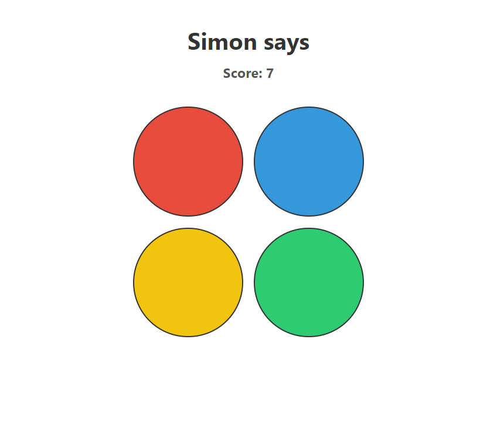

# Simon-Says-Gamet

Welcome to the Simon Says game project! This classic memory game challenges players to repeat a sequence of colors. Can you remember the pattern and beat Simon?

## How to Play

1. Open this repository in your web browser.
2. Press any key to begin the game.
3. Simon will play a sequence of colors.
4. Repeat the sequence by clicking the buttons in the correct order.
5. If you succeed, Simon will add a new step to the sequence.
6. If you make a mistake, the game will end.

## Project Structure

|-- index.html
|-- style.css
|-- script.js
|-- README.md

## Technologies Used

- HTML
- CSS
- JavaScript

## Preview

[]

## Contributing

Contributions are welcome! Please open an issue or submit a pull request.
